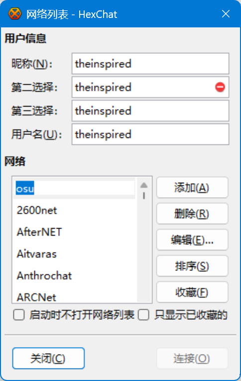

# osu! IRC 使用指南

## 先决条件

* 一个 IRC 客户端  （本教程使用 [HexChat](https://hexchat.github.io/)）
* 你在 osu! 的 IRC 密码 [点击此处获取](https://osu.ppy.sh/home/account/edit#legacy-api)

## 如何连接

打开 HexChat，首次启动会提醒你添加网络，我们可以在此添加一个名为 `osu` 的网络。

<details>
<summary>查看示例</summary>



</details>
</br>

点击 `编辑(E)...`，进入网络编辑页面

在这里，你需要

* 将上方的服务器地址改为 `irc.ppy.sh/6667`
* 昵称改为你在 osu! 的用户名（用户名中有空格的需用下划线 `_` 代替）
* 密码填写为你获取到的密码
* 关闭 `在本网络的所有服务器上使用 SSL`

<details>
<summary>网络编辑页面示例</summary>


</details>
</br>

完成之后点击 `连接(O)` 即可连接

> [!NOTE]
> 由于 HexChat 的字体问题，连接之后通常会出现中文乱码的现象，你需要在 `设置(E)` - `首选项(P)` - `外观` - `一般` 中切换一款支持中文的字体（如微软雅黑）。

> [!NOTE]
> 可到 [osu! 的官方 wiki](https://osu.ppy.sh/wiki/zh/Community/Internet_Relay_Chat) 查看更多说明

## 使用 IRC

连接成功图例


## 创建并管理多人游戏
可使用 `/query Banchobot` 后对其发送 `!mp make <房间名>` 以开始

房间创建好后向你发送比赛链接并自动将你拉入房间聊天频道

> [!INFO]
> 可在 [osu! wiki](https://osu.ppy.sh/wiki/zh/osu%21_tournament_client/osu%21tourney/Tournament_management_commands) 查阅比赛管理指令

以下是与游戏内聊天不同之处

* 玩家进入与退出多人房间时，BanchoBot 会提醒某人的活动

```text
<BanchoBot> (username) joined in slot (number).
<BanchoBot> (username) left the game.
```

* 所有玩家准备好后会进行提示

```text
<BanchoBot> All players are ready
```

* 一轮游戏完成后，会按排名显示结果及通过情况

```text
<BanchoBot> (username) finished playing (Score: 114514, PASSED).
```